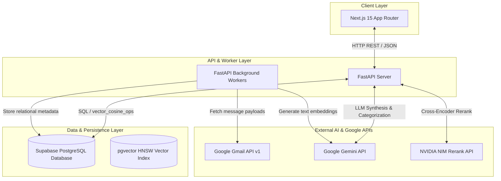
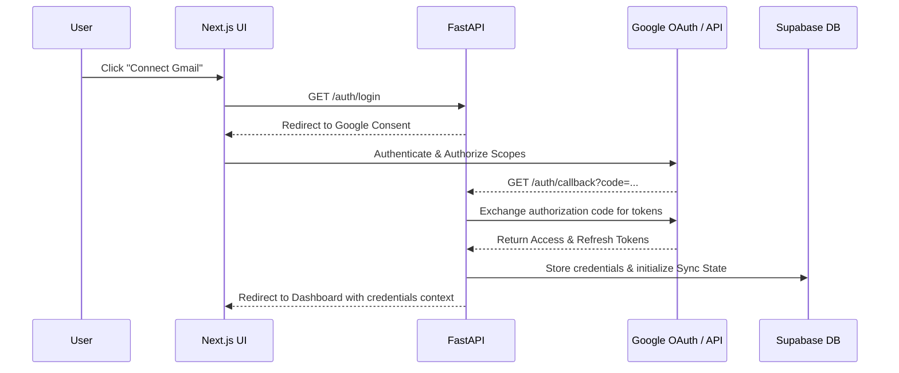
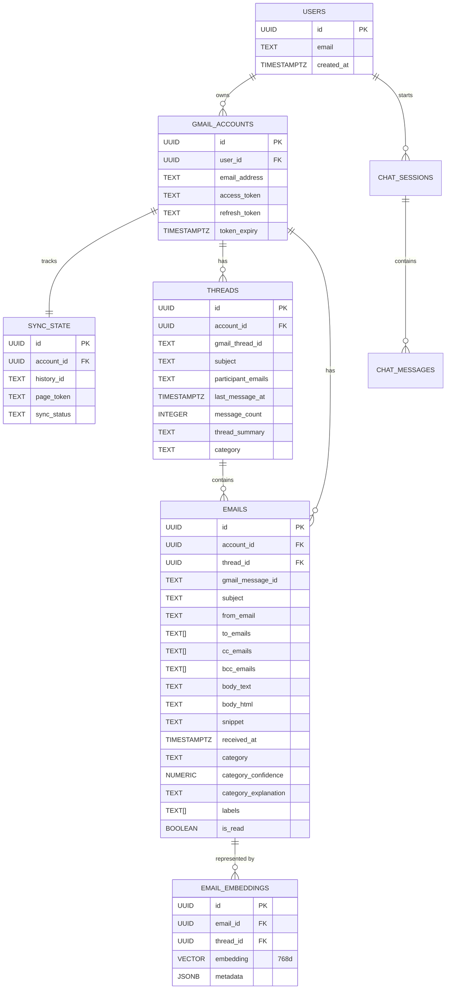
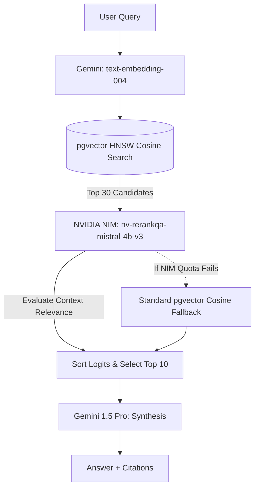

<!-- OVO.AI Banner -->
<p align="center">
  
</p>

# Architecture & Technical Design Document

**Gmail Intelligence Platform (Repeatless Technical Assessment)**

This document details the system architecture, database design, AI pipeline orchestration, Gmail synchronization strategy, and deployment architecture for the Repeatless Gmail Intelligence Platform. It is written at a Senior/Principal Engineer level to detail the technical tradeoffs and design decisions made to ensure scalability, security, and accuracy.

---

## 1. System Architecture

The platform uses a decoupled, three-tier service architecture. Heavy I/O (fetching Gmail payloads) and high-latency LLM tasks are processed asynchronously, ensuring a responsive, non-blocking client interface.



*   **Next.js 15 Client**: Built using React Server Components for server-side cached inbox loads, combined with Zustand for client-side navigation filters, compose modals, and active chat states.
*   **FastAPI Backend**: Orchestrates API routes and utilizes in-process `BackgroundTasks` as a lightweight worker queue to process email sync, categorization, summarization, and vector embedding pipelines.
*   **Supabase Database**: Acts as the single source of truth, utilizing `pgvector` to store and query semantic text vectors alongside relational user data.

---

## 2. Gmail Integration & Synchronization Strategy

The Gmail module connects securely to user inboxes using the Google Gmail API v1 over OAuth 2.0.



### Authentication & Credential Storage
*   **OAuth Scopes**: Requests `https://mail.google.com/` (or `https://www.googleapis.com/auth/gmail.modify`) for reading inbox items, updating labels, and sending thread replies.
*   **Auto-Refresh Lifecycle**: Google access tokens expire after 3600 seconds. The backend `GmailAuthWrapper` checks token expiry on every API client initialization, automatically performing a client credentials refresh using the `refresh_token` when needed, persisting the updated credentials to the database.

### Sync Pipeline Design (Initial vs. Incremental)
*   **Initial Full Sync**: Runs when `history_id` is missing in the database.
    1.  Queries `users.messages.list` with a page boundary size of `20` messages.
    2.  Gracefully paginates through results by checking `nextPageToken` in a `while` loop (up to a 100-message safety limit for assessment sandbox environments).
    3.  Sequentially calls `users.messages.get` for each message, extracting subject, sender, HTML/plain text parts, date, snippet, and labels.
    4.  Stores the latest Google `historyId` in the `sync_state` table.
*   **Incremental Sync**: Executes on subsequent sync triggers to minimize token costs and database writes by 99%.
    1.  Retrieves the stored `history_id`.
    2.  Calls `users.history.list(startHistoryId=history_id)`.
    3.  Parses the `messagesAdded` events to fetch only new messages, and handles label modification events.
    4.  Updates the `history_id` reference with the latest `historyId` returned by the history payload.

---

## 3. Database Schema

The database uses PostgreSQL normalization with cascade deletion rules to guarantee referential integrity. 



### pgvector Design
*   **Dimensionality**: Uses `vector(768)` matching the outputs of Gemini's `text-embedding-004` model.
*   **HNSW Indexing**: A Hierarchical Navigable Small World (`HNSW`) index is declared on the `embedding` column using `vector_cosine_ops` to enable sub-millisecond retrieval speeds for semantic vector lookups:
    ```sql
    CREATE INDEX idx_email_embeddings_embedding 
    ON email_embeddings USING hnsw (embedding vector_cosine_ops) 
    WITH (m = 16, ef_construction = 64);
    ```
*   **Context-Aware Chunking**: To prevent context dilution (e.g. embedding the string "I agree" contains no semantic connection to the topic without subject/sender context), we prepend `Sender: <email>` and `Subject: <subject>` directly to each text chunk before embedding.

---

## 4. AI Design & Prompt Engineering

The system routes specific features to appropriate AI models to optimize latency, reasoning complexity, and costs.

### Model Matrix
*   **Gemini 1.5 Flash**: Processes high-volume, low-latency tasks (email summarization, structured classification, and composition drafting).
*   **Gemini 1.5 Pro**: Processes complex contextual reasoning tasks (thread-aware reply drafting and conversational RAG synthesis).
*   **NVIDIA NIM (nv-rerankqa-mistral-4b-v3)**: Cross-Encoder model used for context relevance reranking in RAG retrieval.

### Prompt Engineering & Structured Outputs
*   **Strict JSON Output**: Email categorization utilizes Gemini's `response_schema` parameter to return valid, Pydantic-validated JSON matching `EmailClassificationResult`. This prevents parsing errors caused by conversational prefix boilerplate ("Here is your category...").
*   **Chronological Thread Summarization**: Leverages Gemini's 1M token context window by feeding the entire chronological thread (up to a 100k safety cutoff) into the prompt in a single call. This preserves context and pronoun resolution.

---

## 5. Retrieval-Augmented Generation (RAG) Pipeline

The Chat Agent uses a hybrid vector search and Cross-Encoder reranking pipeline to return highly accurate, context-relevant answers.



1.  **Vector Search**: The user query is embedded and matched against `email_embeddings` using a PostgreSQL RPC similarity function `match_emails`.
2.  **Distance Threshold Cut-off**: Candidates with a cosine distance $> 0.65$ (poor similarity) are filtered out immediately. This prevents the LLM from synthesizing answers from unrelated emails.
3.  **NVIDIA NIM Reranking**: The top 30 candidate chunks are scored by the NVIDIA Cross-Encoder, sorting them down to the true top 10 based on context relevance.
4.  **Resilient Fallback**: If the NVIDIA NIM API fails or throttles, the retriever catches the exception and falls back to standard pgvector cosine distance, ensuring system availability.
5.  **Conversational Memory**: Fetches the last 6 messages from the active chat session in the database to maintain conversational context.
6.  **Synthesis**: Gemini 1.5 Pro synthesizes the final response using the context block.

---

## 6. Thread Awareness & Preserving Grouping

Representing email threads as a first-class concept is critical for thread-aware replies and conversational RAG.

### Database Integration
*   The `threads` table tracks aggregated thread-level summaries, category taxonomy, participant email arrays, and message counts.
*   Every email synced is linked to its parent thread UUID.

### Gmail Thread Preservation
For Gmail to visually group sent replies into the correct native thread, the backend maps RFC 2822 threading headers:
*   **In-Reply-To**: Set to the `Message-ID` header of the email we are directly replying to.
*   **References**: Space-separated string containing the `Message-ID` of all previous emails in the thread.
*   **threadId**: Set to the original Gmail thread ID in the API transmission envelope.

---

## 7. Source Attribution & Hallucination Prevention

To satisfy assessment requirements, the agent behaves strictly as an assistant that has read only the user's emails and cites sources accurately.

### Hallucination Prevention (Parametric Lock)
The system prompt enforces a strict lock:
1.  **Parametric Knowledge Ban**: Bans the use of general pre-trained knowledge. If asked about a topic (e.g., "what is Kubernetes?"), the agent must explain it *only* using terms found in the context.
2.  **Explicit Rejection**: If the answer cannot be found in the context, the agent must reply: *"I cannot find this information in your emails."*

### Source Attribution (Over-Citation Prevention)
To ensure citations are authentic:
1.  **Citation Constraint**: The prompt forces the LLM to output inline UUID references: `[Source: <email_id>]`.
2.  **Regex Post-Processing**: Instead of returning all retrieved documents as cited sources, the backend parses the LLM's final response using a strict regex: `\[Source:\s*([a-f0-9\-]{36})\]`. Only the UUIDs actually cited in the text are returned to the client.

---

## 8. Rate Limiting, API Quotas, & Resilience

Handling thousands of emails requires robust rate limit mitigation.

*   **tenacity Retry Handler**: All Google API calls are wrapped in retry decorators configured with exponential backoff (`wait_exponential(multiplier=1, min=2, max=10)`) and stop after 5 attempts, catching transient network anomalies and rate limit warnings (HTTP 429).
*   **Throttling**: The sync engine handles page pagination sequentially to avoid triggering user-rate quota limits from parallel page fetch calls.

---

## 9. Security & Hardening Architecture

Production deployment requires strict security isolation:
1.  **Row Level Security (RLS)**: Enabled on all tables to prevent cross-tenant reading. Users can only read data associated with their own `user_id`.
2.  **Token Encryption at Rest**: Google API credentials (refresh and access tokens) must be encrypted symmetrically using AES-256 before storage in `gmail_accounts`.
3.  **CORS Domain Locking**: Restricts backend CORS origin policies in production to the Vercel frontend domain, rejecting unauthorized external client queries.

---

## 10. Technology Trade-offs & Limitations

### 1. In-Process Background Task Workers
*   **Trade-off**: Used FastAPI `BackgroundTasks` instead of Celery/RabbitMQ or Temporal.
*   **Limitation**: Sync jobs run inside the FastAPI process. If the container restarts, the sync job dies. This was chosen to prioritize a simple, zero-config local run environment.

### 2. Context Aggregation vs. Single-Chunk Retrieval
*   **Trade-off**: Vector search retrieves email text chunks.
*   **Limitation**: Chunks can be fragmented. The system mitigates this by fetching the parent thread's full chronology when a chunk matches, ensuring context continuity.

---

## 11. Future Improvements

1.  **Persistent Queue Integration**: Deploy a Redis-backed Celery worker stack to handle email syncing and vector embedding pipelines reliably.
2.  **Google Cloud Pub/Sub Webhooks**: Configure Google push notifications to trigger sync jobs automatically when emails arrive, replacing manual polling.
3.  **Semantic Clustering for Deduplication**: Deploy an offline clustering algorithm (like DBSCAN) on newsletter embeddings to group news stories semantically, providing digests.
