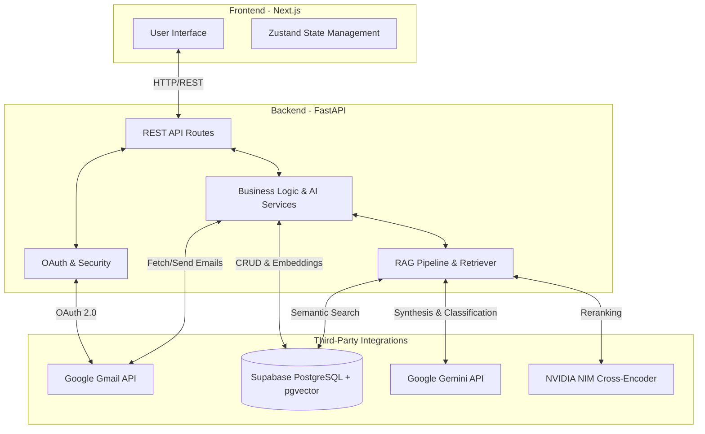

# Architecture & Design Document

## 1. System Overview
The **Gmail Intelligence Platform (OVO.AI)** is an advanced, AI-driven workspace orchestration assistant. It syncs, indexes, and categorizes email records from Google Workspace, and provides users with a generative AI interface (RAG) to query their inbox semantically, draft replies, and summarize complex email threads.

The system utilizes a decoupled Client-Server architecture, leveraging modern web frameworks, vector databases, and state-of-the-art Large Language Models (LLMs).

## 2. High-Level Architecture

## 3. Technology Stack

### Frontend (Presentation Layer)
- **Framework:** Next.js 16 (App Router) & React 19
- **Styling & UI:** Tailwind CSS v4, Framer Motion (Animations), Lucide Icons
- **State Management:** Zustand
- **Deployment:** Vercel

### Backend (Application Layer)
- **Framework:** FastAPI (Python) running on Uvicorn
- **Data Validation:** Pydantic v2
- **Deployment:** Render (Dockerized)

### Data & AI Layer
- **Database:** Supabase (PostgreSQL with `pgvector` for semantic embeddings)
- **Authentication:** Google OAuth 2.0
- **Generative AI:** Google Gemini 2.0 Flash (Summarization, Composition, Categorization)
- **RAG Pipeline:** Langchain Text Splitters, NVIDIA NIM API (Cross-Encoder for precision reranking)

## 4. Core Workflows & Logic

### 4.1. Authentication Flow
1. The user clicks "Sign in with Google" on the frontend.
2. The frontend redirects to the backend `/api/v1/auth/login` endpoint, appending the frontend callback URI as `redirect_uri` in the state.
3. The backend generates a Google OAuth consent URL and redirects the user to Google.
4. Upon consent, Google redirects the user back to the backend `/api/v1/auth/callback` with an authorization code.
5. The backend exchanges the code for Access & Refresh tokens, retrieves the user's primary email, encrypts the tokens (AES-256), and stores them in Supabase.
6. The backend redirects the user back to the frontend with session identifiers (`account_id`, `user_id`).

### 4.2. Email Synchronization Pipeline
1. The frontend invokes the `/api/v1/sync/full` endpoint.
2. The backend retrieves the decrypted Google OAuth tokens from Supabase.
3. The backend makes paginated requests to the Gmail API to fetch threads and individual messages.
4. Emails are sanitized (HTML stripping) and split into chunks using Langchain.
5. Chunks are passed to an embedding model to generate dense vectors.
6. The vectors and metadata are stored in Supabase `pgvector` tables for future retrieval.
7. Concurrently, a background AI service categorizes the email (e.g., Work, Finance, Job) using Gemini.

### 4.3. Retrieval-Augmented Generation (RAG) Chat Pipeline
1. The user inputs a semantic query (e.g., "What is the status of my NVIDIA invoice?").
2. The query is embedded into a vector by the backend.
3. A cosine similarity search is executed against the `pgvector` database to retrieve the top-k most relevant email chunks.
4. **Reranking:** The retrieved chunks are sent to the NVIDIA NIM Cross-Encoder to re-score and re-rank them based on absolute relevance to the query, filtering out noise.
5. **Synthesis:** The top reranked chunks are injected into a strict prompt context and sent to the Gemini API.
6. Gemini synthesizes a cohesive, accurate answer based *only* on the provided inbox context, returning it to the user.

## 5. Data Model

The application utilizes a relational database structure housed in Supabase:
- **`users`**: Stores unique platform users.
- **`gmail_accounts`**: Links `users` to Google accounts; stores AES-encrypted OAuth tokens.
- **`email_threads`**: Stores thread-level metadata and AI-generated thread summaries.
- **`email_messages`**: Stores individual email bodies, sender/recipient metadata, and AI categories.
- **`email_embeddings`**: Stores `pgvector` representations of chunked email bodies for semantic search.
- **`chat_sessions` & `chat_messages`**: Maintains history for the RAG chat interface.

## 6. Security & Privacy
- **Token Encryption:** All Google OAuth Access and Refresh tokens are encrypted symmetrically (AES-256 via Python Cryptography) before being stored at rest in the database.
- **Data Isolation:** All database queries and vector searches strictly filter by `user_id` and `account_id` to prevent cross-tenant data leakage.
- **Terms Consent Guard:** Frontend route guards ensure users explicitly agree to the Terms of Service and Privacy Policy prior to triggering the OAuth flow.
- **Minimal Scopes:** The application only requests necessary Gmail API scopes (read-only for sync, send for compose/reply).

## 7. Scalability & Performance considerations
- **Vector Reranking:** By separating retrieval (`pgvector` cosine similarity) from reranking (NVIDIA Cross-Encoder), the system balances low-latency database reads with high-precision contextual accuracy.
- **Stateless Backend:** The FastAPI backend is completely stateless, enabling horizontal scaling via Docker containers.
- **Frontend Optimization:** The Next.js frontend utilizes Edge caching, static asset optimization, and React 19 concurrent features to ensure a high-performance UI.
