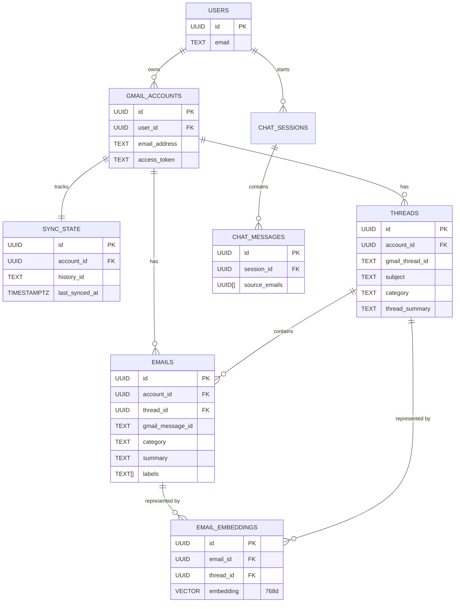

# Database Schema Design: Supabase (PostgreSQL + pgvector)

## 1. Entity-Relationship (ER) Diagram

## 2. Foreign Keys & Integrity

The schema uses `UUID` (v4) for all primary keys to ensure global uniqueness and prevent ID enumeration. 
Integrity constraints enforce the hierarchy:
*   **Cascade Deletes:** If a user deletes their account, the `GMAIL_ACCOUNTS` record is deleted. This automatically cascades down and deletes all `THREADS`, `EMAILS`, `SYNC_STATE`, and `EMAIL_EMBEDDINGS` via `ON DELETE CASCADE`.
*   **Unique Constraints:** 
    *   `UNIQUE(account_id, gmail_message_id)` on `emails` ensures no duplicate messages are synced.
    *   `UNIQUE(account_id, gmail_thread_id)` on `threads` prevents duplicate threads.

## 3. Indexes & Performance Optimizations

To handle thousands of emails smoothly, specific indexes are utilized:

### Lookups & Joins (B-Tree)
Standard B-Tree indexes are applied to foreign keys and commonly filtered columns:
*   `CREATE INDEX idx_emails_thread_id ON emails(thread_id);` (speeds up fetching all emails for a specific thread)
*   `CREATE INDEX idx_emails_received_at ON emails(received_at DESC);` (speeds up sorting the inbox)
*   `CREATE INDEX idx_emails_category ON emails(category);` (speeds up filtering by AI category)

### Array & Metadata Search (GIN)
Since labels and recipients are arrays, GIN (Generalized Inverted Index) is used:
*   `CREATE INDEX idx_emails_labels_gin ON emails USING GIN (labels);` (Fast retrieval of emails matching specific Gmail labels like 'INBOX').

### Vector Search (HNSW)
*   Instead of exact nearest neighbors (IVFFlat), we use **HNSW** (Hierarchical Navigable Small World). It provides much faster search times for embeddings with a negligible loss in recall.
*   `CREATE INDEX idx_email_embeddings_embedding ON email_embeddings USING hnsw (embedding vector_cosine_ops) WITH (m = 16, ef_construction = 64);`

## 4. pgvector Design

*   **Dimensionality:** The `embedding` column uses `vector(768)`. This matches exactly with Google Gemini's `text-embedding-004` output.
*   **Hybrid Entity Embedding:** The `email_embeddings` table references both `email_id` and `thread_id`. The `content_type` distinguishes if the vector represents a single message body or an aggregate thread summary. This allows the RAG pipeline to search across both granular facts and broad context simultaneously.
*   **Distance Metric:** We use `vector_cosine_ops` (Cosine Similarity) instead of Euclidean distance, as it performs significantly better for semantic text matching.

## 5. Handling Incremental Sync

The `sync_state` table is critical for performance:
*   Rather than parsing the entire inbox repeatedly, the system stores Google's `history_id` and `page_token`. 
*   On subsequent syncs, the backend calls `gmail.users.history.list` using the stored `history_id`. This guarantees we only download exactly what has been added, removed, or modified since the last successful sync operation.

---
**SQL Source:** The complete DDL migration script can be found at `supabase/migrations/001_initial_schema.sql`
