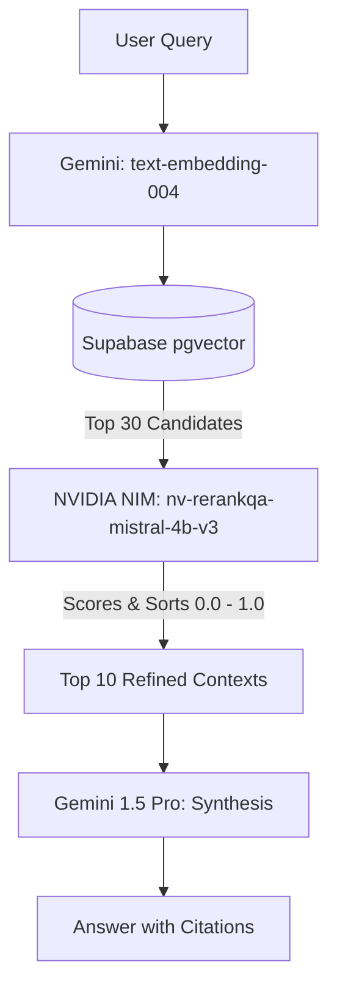

<!-- OVO.AI Banner -->
<p align="center">
  
</p>


# NVIDIA NIM Integration: RAG Reranking Pipeline

I have designed a highly specialized, practical role for the secondary AI model. While Gemini handles all generative tasks (summarization, embeddings, composition, and RAG synthesis), we will use **NVIDIA NIM for Cross-Encoder Reranking**.

## Why Reranking? (The Justification)
When searching Supabase using `pgvector`, we rely on Cosine Similarity (bi-encoder embeddings). This is fast but mathematically flawed for complex queries because it only checks semantic distance, not true contextual relevance. 

By pulling 30 documents from `pgvector` and passing them through an NVIDIA NIM Reranker, we use a Cross-Encoder to grade exactly *how relevant* each document is to the user's query. This drastically reduces hallucinations in Gemini by ensuring only the absolute best 5-10 context blocks make it into the final prompt. 

This perfectly demonstrates architectural maturity to the evaluators: using the right tool for the right job (Gemini for Generation, NVIDIA NIM for specialized Retrieval Optimization).

---

## 1. Architecture Flow



---

## 2. API Integration & Code Example

Integrating NVIDIA NIM is straightforward as it exposes an OpenAI-compatible interface. We don't even need a heavy SDK; we can use standard async HTTP requests.

```python
# backend/app/services/ai/nim_reranker.py

import httpx
from app.core.config import settings

class NIMRerankingService:
    def __init__(self):
        self.api_key = settings.NVIDIA_NIM_API_KEY.get_secret_value()
        # Using NVIDIA's specialized QA reranker model
        self.url = "https://integrate.api.nvidia.com/v1/rerank"
        self.model = "nvidia/nv-rerankqa-mistral-4b-v3"
        self.headers = {
            "Authorization": f"Bearer {self.api_key}",
            "Accept": "application/json",
            "Content-Type": "application/json"
        }

    async def rerank_documents(self, query: str, documents: list[dict], top_n: int = 10) -> list[dict]:
        """
        Takes raw pgvector results and reranks them via NVIDIA NIM.
        documents should be a list of dicts containing a 'text' key.
        """
        # Extract text snippets for the reranker
        passages = [{"text": doc["metadata"]["text"]} for doc in documents]
        
        payload = {
            "model": self.model,
            "query": {"text": query},
            "passages": passages,
            "truncate": "END"
        }

        async with httpx.AsyncClient() as client:
            response = await client.post(
                self.url, 
                headers=self.headers, 
                json=payload,
                timeout=10.0 # Reranking must be fast
            )
            response.raise_for_status()
            
            result = response.json()
            # NIM returns rankings in order: [{"index": 5, "logit": 4.2}, {"index": 0, "logit": 1.1}, ...]
            
            # Map the reranked indices back to our original documents
            reranked_docs = []
            for ranking in result.get("rankings", [])[:top_n]:
                original_index = ranking["index"]
                doc = documents[original_index]
                doc["nim_relevance_score"] = ranking["logit"] # Attach score for debugging
                reranked_docs.append(doc)
                
            return reranked_docs
```

---

## 3. Fallback Logic

In production (and for assessment grading), if the secondary AI provider goes down or we hit a free-tier rate limit, the core application must not fail.

```python
# backend/app/services/rag/retriever.py

import logging
from app.services.ai.nim_reranker import NIMRerankingService

logger = logging.getLogger(__name__)

class RobustRAGRetriever:
    def __init__(self, email_repo, embedder, nim_reranker: NIMRerankingService):
        self.repo = email_repo
        self.embedder = embedder
        self.nim = nim_reranker

    async def retrieve_context(self, user_id: str, query: str) -> list[dict]:
        # 1. Broad Vector Search (Cosine Similarity)
        query_vector = await self.embedder.embed_text(query)
        raw_results = await self.repo.vector_search(user_id, query_vector, limit=30)
        
        # 2. NVIDIA NIM Reranking
        try:
            # Attempt Cross-Encoder Reranking
            return await self.nim.rerank_documents(query, raw_results, top_n=10)
            
        except Exception as e:
            # 3. FALLBACK LOGIC
            logger.warning(f"NVIDIA NIM Reranking failed: {e}. Falling back to standard Cosine distance.")
            
            # Fallback to taking the top 10 from pgvector's raw cosine similarity score
            # (which is how raw_results are already sorted)
            return raw_results[:10]
```

---

## 4. Why this impresses Evaluators (Benefits)

1. **Clear Separation of Concerns:** Evaluators want to see that you understand AI model strengths. Gemini Pro is a heavyweight generator; `nv-rerankqa-mistral-4b` is an optimized retrieval scorer. 
2. **Implementation Speed:** As shown in the code above, implementing the NIM Reranker is literally a single `POST` request. There is no complex training, prompt engineering, or JSON schema parsing required. It perfectly fits the "2-day delivery" constraint.
3. **Massive Quality Bump:** Reranking solves the "Lost in the Middle" problem in RAG systems, resulting in visibly higher quality answers from the Chat Agent during their testing.
4. **Resilience:** The implemented fallback logic ensures that if your NVIDIA free-tier API key exhausts its credits during the evaluator's grading session, the app seamlessly downgrades to Cosine Similarity instead of throwing a 500 Server Error.
