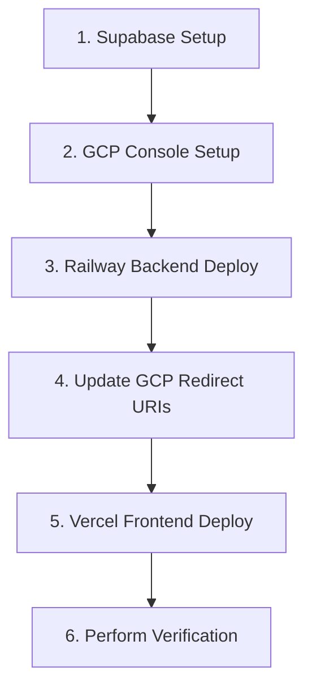

<!-- OVO.AI Banner -->
<p align="center">
  
</p>


# Production Deployment Guide: Gmail Intelligence Platform

This guide outlines the production deployment steps for the **Gmail Intelligence Platform**, targeting **Vercel** for the frontend, **Railway** for the backend, and **Supabase** for the database.

---

## 🔑 1. Environment Variables Configuration

To run the application in a live production environment (with `SANDBOX_MODE=false`), you must set the following environment variables in their respective dashboards.

### Database: Supabase
No additional environment variables are required in Supabase itself. However, you must retrieve the database connection details:
1. Go to **Project Settings ➡️ Database** to copy the transaction/session pooler connection string.
2. Go to **Project Settings ➡️ API** to copy the **Project URL** and the **Service Role Key (secret)**.

### Backend: Railway
Configure these environment variables in your Railway Service dashboard:

| Variable | Recommended Production Value | Description |
| :--- | :--- | :--- |
| `SANDBOX_MODE` | `false` | **CRITICAL:** Set to `false` to enable live Gmail API, Gemini, and NIM integration instead of mocks. |
| `PROJECT_NAME` | `"Repeatless AI"` | The title of the API platform. |
| `API_V1_STR` | `"/api/v1"` | The routing prefix for backend endpoints. |
| `SUPABASE_URL` | `https://[your-project-id].supabase.co` | The API URL of your Supabase instance. |
| `SUPABASE_SERVICE_ROLE_KEY` | `[your-service-role-secret-key]` | Service role JWT key (bypasses RLS to write background-synced emails). |
| `GOOGLE_CLIENT_ID` | `[your-google-oauth-client-id]` | GCP Web Application client ID. |
| `GOOGLE_CLIENT_SECRET` | `[your-google-oauth-client-secret]` | GCP Web Application client secret. |
| `GOOGLE_REDIRECT_URI` | `https://[your-railway-backend-domain]/api/v1/auth/callback` | OAuth redirect callback URL (must match GCP settings). |
| `GEMINI_API_KEY` | `[your-google-ai-studio-api-key]` | API key for Gemini 1.5/2.0 summarization & response generation. |
| `NVIDIA_NIM_API_KEY` | `[your-nvidia-nim-api-key]` | API key for NVIDIA reranking (`nv-rerankqa-mistral-4b-v3`). |
| `PORT` | `8000` | Port the container listens on (injected automatically by Railway). |

### Frontend: Vercel
Configure these environment variables in your Vercel Project dashboard:

| Variable | Production Value | Description |
| :--- | :--- | :--- |
| `NEXT_PUBLIC_API_URL` | `https://[your-railway-backend-domain]/api/v1` | Publicly accessible URL pointing to your backend Railway endpoints. |

---

## 🏗️ 2. Build Commands

### Backend: Railway
Railway automatically detects the `/backend/Dockerfile` if configured to build the backend service.
* **Build Command**: (Automatically managed by Docker build)
  ```bash
  docker build -t backend -f Dockerfile .
  ```
  *(During this phase, Railway installs system dependencies, updates pip, and compiles Python modules from `requirements.txt`.)*

### Frontend: Vercel
Vercel automatically detects Next.js.
* **Build Command**: `next build`
* **Root Directory**: `frontend` *(Set this in Vercel project configuration)*.
* **Output Directory**: `.next` (Default)

---

## 🚀 3. Start Commands

### Backend: Railway
The backend start command is defined inside `/backend/Dockerfile`:
* **Start Command**:
  ```bash
  uvicorn app.main:app --host 0.0.0.0 --port 8000
  ```
  *(Note: Railway binds the container port to the host dynamic port matching the `$PORT` environment variable.)*

### Frontend: Vercel
* **Start Command**: Vercel handles the execution automatically via serverless function routing. Next.js edge and serverless runtimes execute automatically without a manual start command.

---

## 🔄 4. Deployment Sequence

To prevent circular dependencies (e.g. configuring Google redirect callback URL before having a backend domain), execute deployment in the following order:



### Step 1: Database Setup (Supabase)
1. Log in to [Supabase](https://supabase.com/). Create a new database project.
2. Open the **SQL Editor** in the sidebar.
3. Apply the initial schemas sequentially:
   - Run the script in [001_initial_schema.sql](file:///c:/Users/indra/repeatless/supabase/migrations/001_initial_schema.sql) to create `gmail_accounts`, `threads`, `emails`, `vector_embeddings`, and `chat_logs` tables.
   - Run the script in [002_match_emails.sql](file:///c:/Users/indra/repeatless/supabase/migrations/002_match_emails.sql) to compile the pgvector match function (`match_emails`).
4. Go to **Settings ➡️ API** and copy the **Project URL** and the **Service Role Key**.

### Step 2: Google Cloud Console Setup
1. Log in to the [Google Cloud Console](https://console.cloud.google.com/).
2. Create or select a project and enable the **Gmail API** inside the Library.
3. Configure the **OAuth Consent Screen**:
   - Application Type: **External**.
   - Add scopes: `https://mail.google.com/` (or `https://www.googleapis.com/auth/gmail.modify`).
   - **Important**: Add your Gmail accounts to the **Test Users** list, otherwise Google will block authentication.
4. Go to **Credentials ➡️ Create Credentials ➡️ OAuth Client ID**:
   - Application Type: **Web Application**.
   - Create the client. Leave redirect URIs blank for now. Copy the **Client ID** and **Client Secret**.

### Step 3: Deploy Backend (Railway)
1. Link your Git repository to [Railway](https://railway.app/).
2. Click **New Service ➡️ GitHub Repository** and select your repository.
3. Set the **Root Directory** settings option to `backend`.
4. In the service **Variables** tab, enter all the backend environment variables listed in Section 1 (use placeholders for `GOOGLE_REDIRECT_URI` if necessary).
5. Railway will deploy the container. Once completed, go to **Settings ➡️ Networking** and click **Generate Domain** to get your public backend URL (e.g. `https://repeatless-backend.up.railway.app`).

### Step 4: Link Redirect URIs in Google Cloud
1. Return to the Google Cloud Console ➡️ **Credentials** section.
2. Edit your OAuth Client ID configuration.
3. Under **Authorized Redirect URIs**, enter:
   `https://[your-railway-backend-domain]/api/v1/auth/callback`
   *(e.g., `https://repeatless-backend.up.railway.app/api/v1/auth/callback`)*
4. Save the changes.
5. In Railway, update the `GOOGLE_REDIRECT_URI` environment variable to match this exact value. Redeploy the service to apply changes.

### Step 5: Deploy Frontend (Vercel)
1. Log in to [Vercel](https://vercel.com/) and click **Add New Project**.
2. Select your repository.
3. Under project configurations:
   - Set the **Root Directory** to `frontend`.
   - Vercel will auto-configure Next.js.
4. Under the **Environment Variables** section, add:
   - `NEXT_PUBLIC_API_URL` pointing to your Railway backend API: `https://[your-railway-backend-domain]/api/v1`.
5. Click **Deploy**. Vercel will compile and host your Next.js application.

---

## ✅ 5. Verification Checklist

Execute these validation checks once deployment is complete to ensure the platform is healthy:

- [ ] **Health Check Verification**
  - Access `https://[your-railway-domain]/` in a browser.
  - Verify it returns a JSON response: `{"status": "healthy", "sandbox_mode": false}`.
- [ ] **Google OAuth Redirection**
  - Access your production Vercel frontend URL.
  - Click **Connect Gmail**.
  - Verify that the app redirects to the Google Account selection interface, showing your OAuth client credentials.
- [ ] **Gmail Authentication & Access**
  - Authenticate using a registered Google Test User account.
  - Verify that you are redirected back to the Vercel dashboard with a success indicator.
- [ ] **Inbox Sync & Database Write**
  - Click **Sync Inbox** on the dashboard.
  - Monitor the Railway application logs. Verify that the system queries Google API pages, parses email content, categories them, and inserts them into Supabase.
  - In Supabase, verify that rows are successfully inserted in `gmail_accounts`, `threads`, and `emails`.
- [ ] **AI Summarization & RAG Engine**
  - Select an email thread and verify that a coherent, timeline-aware AI summary is generated.
  - Open the AI RAG Chat Agent. Ask a question about synchronized emails (e.g. *"When is the project deadline?"*).
  - Verify that the agent replies correctly with the answers derived strictly from the database context and links a citation card referencing the source email.
